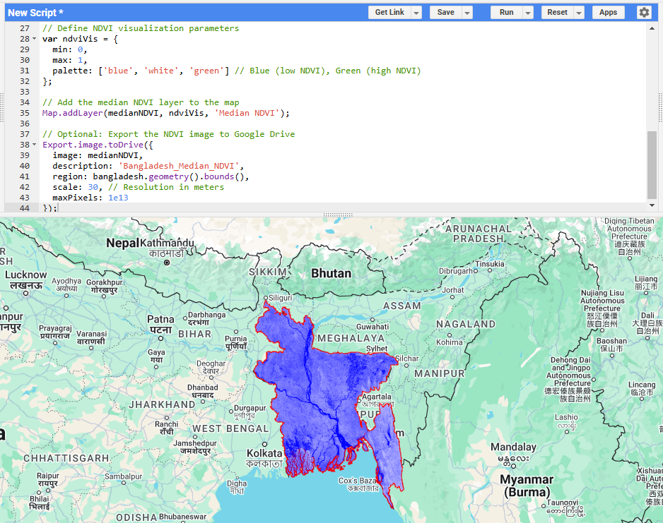

## Exploring Vegetation Health in Bangladesh Using Google Earth Engine

I'm thrilled to share my recent project where I leveraged Google Earth Engine (GEE) and JavaScript to create an NDVI (Normalized Difference Vegetation Index) map of Bangladesh. This visualization provides crucial insights into vegetation health across the country, helping to monitor and manage environmental sustainability.

- **Highlights of the project:** Used Landsat imagery to compute NDVI values.
Mapped the NDVI results with a clear color-coded scale: from blue (low vegetation) to green (high vegetation).
Calculated the mean NDVI for Bangladesh, showcasing an average value of 0.308 — indicating moderate vegetation health across the region.

- Why NDVI? NDVI is a powerful tool to measure vegetation vigor and monitor agricultural health, deforestation, and climate impacts. This project demonstrates the potential of geospatial technologies in addressing critical environmental challenges.

- **Tools used:**
Google Earth Engine for remote sensing and data analysis.
JavaScript for scripting and visualization.

- I believe projects like this can pave the way for smarter, data-driven decisions in agriculture, urban planning, and conservation efforts.

## Image

